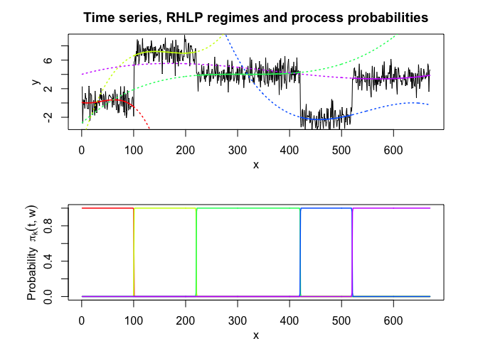
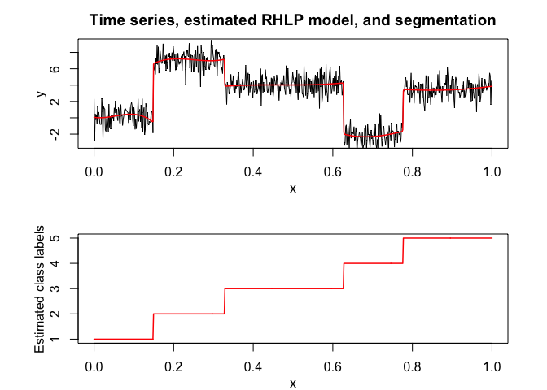

<!-- README.md is generated from README.Rmd. Please edit that file -->

## Overview

<!-- badges: start -->

<!-- badges: end -->

Flexible and user-friendly probabilistic **segmentation** of time series
with smooth and/or abrupt **regime changes** by a **mixture
model-based** regression approach with a hidden logistic process, fitted
by the EM algorithm.

## Installation

You can install the development version of RHLP from
[GitHub](https://github.com/) with:

``` r
# install.packages("devtools")
devtools::install_github("fchamroukhi/RHLP")
```

To build *vignettes* for examples of usage, type the command below
instead:

``` r
# install.packages("devtools")
devtools::install_github("fchamroukhi/RHLP", 
                         build_opts = c("--no-resave-data", "--no-manual"), 
                         build_vignettes = TRUE)
```

Use the following command to display vignettes:

``` r
browseVignettes("RHLP")
```

## Usage

``` r
library(RHLP)

data("toydataset")

K <- 5 # Number of regimes (mixture components)
p <- 3 # Dimension of beta (order of the polynomial regressors)
q <- 1 # Dimension of w (order of the logistic regression: to be set to 1 for segmentation)
variance_type <- "heteroskedastic" # "heteroskedastic" or "homoskedastic" model

n_tries <- 1
max_iter = 1500
threshold <- 1e-6
verbose <- TRUE
verbose_IRLS <- FALSE

rhlp <- emRHLP(toydataset$x, toydataset$y, K, p, q, 
                   variance_type, n_tries, max_iter, threshold, verbose, verbose_IRLS)
#> EM try number: 1
#> 
#> EM: Iteration : 1 || log-likelihood : -2119.27308534609
#> EM: Iteration : 2 || log-likelihood : -1149.01040321999
#> EM: Iteration : 3 || log-likelihood : -1118.20384281234
#> EM: Iteration : 4 || log-likelihood : -1096.88260636121
#> EM: Iteration : 5 || log-likelihood : -1067.55719357295
#> EM: Iteration : 6 || log-likelihood : -1037.26620122646
#> EM: Iteration : 7 || log-likelihood : -1022.71743069484
#> EM: Iteration : 8 || log-likelihood : -1006.11825447077
#> EM: Iteration : 9 || log-likelihood : -1001.18491883952
#> EM: Iteration : 10 || log-likelihood : -1000.91250763556
#> EM: Iteration : 11 || log-likelihood : -1000.62280600209
#> EM: Iteration : 12 || log-likelihood : -1000.3030988811
#> EM: Iteration : 13 || log-likelihood : -999.932334880131
#> EM: Iteration : 14 || log-likelihood : -999.484219706691
#> EM: Iteration : 15 || log-likelihood : -998.928118038989
#> EM: Iteration : 16 || log-likelihood : -998.234244664472
#> EM: Iteration : 17 || log-likelihood : -997.359536276056
#> EM: Iteration : 18 || log-likelihood : -996.152654857298
#> EM: Iteration : 19 || log-likelihood : -994.697863447307
#> EM: Iteration : 20 || log-likelihood : -993.186583974542
#> EM: Iteration : 21 || log-likelihood : -991.81352379631
#> EM: Iteration : 22 || log-likelihood : -990.611295217008
#> EM: Iteration : 23 || log-likelihood : -989.539226273251
#> EM: Iteration : 24 || log-likelihood : -988.55311887915
#> EM: Iteration : 25 || log-likelihood : -987.539963690533
#> EM: Iteration : 26 || log-likelihood : -986.073920116541
#> EM: Iteration : 27 || log-likelihood : -983.263549878169
#> EM: Iteration : 28 || log-likelihood : -979.340492188909
#> EM: Iteration : 29 || log-likelihood : -977.468559852711
#> EM: Iteration : 30 || log-likelihood : -976.653534236095
#> EM: Iteration : 31 || log-likelihood : -976.5893387433
#> EM: Iteration : 32 || log-likelihood : -976.589338067237

rhlp$summary()
#> ---------------------
#> Fitted RHLP model
#> ---------------------
#> 
#> RHLP model with K = 5 components:
#> 
#>  log-likelihood nu       AIC       BIC       ICL
#>       -976.5893 33 -1009.589 -1083.959 -1083.176
#> 
#> Clustering table (Number of observations in each regimes):
#> 
#>   1   2   3   4   5 
#> 100 120 200 100 150 
#> 
#> Regression coefficients:
#> 
#>       Beta(K = 1) Beta(K = 2) Beta(K = 3) Beta(K = 4) Beta(K = 5)
#> 1    6.031875e-02   -5.434903   -2.770416    120.7699    4.027542
#> X^1 -7.424718e+00  158.705091   43.879453   -474.5888   13.194261
#> X^2  2.931652e+02 -650.592347  -94.194780    597.7948  -33.760603
#> X^3 -1.823560e+03  865.329795   67.197059   -244.2386   20.402153
#> 
#> Variances:
#> 
#>  Sigma2(K = 1) Sigma2(K = 2) Sigma2(K = 3) Sigma2(K = 4) Sigma2(K = 5)
#>       1.220624      1.110243      1.079394     0.9779734      1.028332

rhlp$plot()
```


