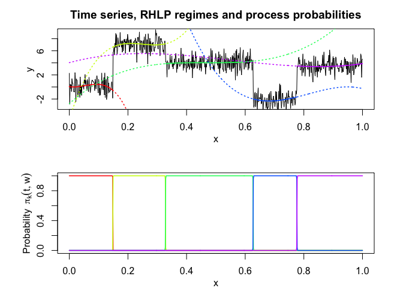
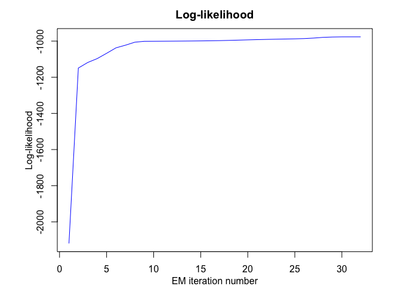
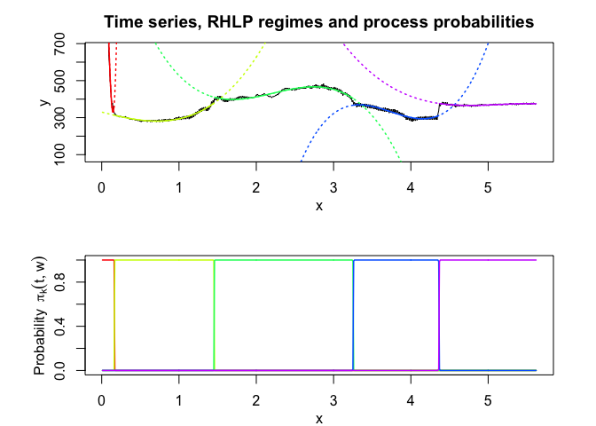
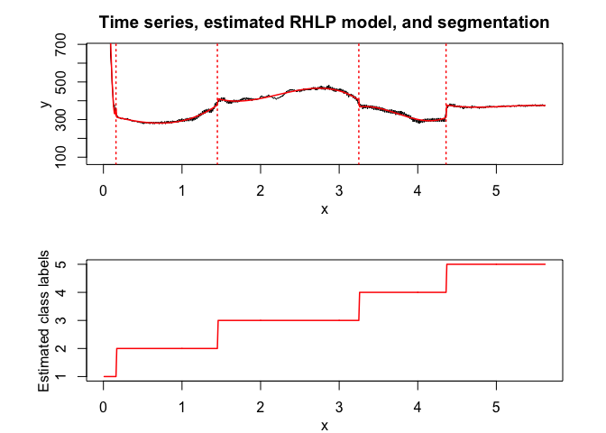
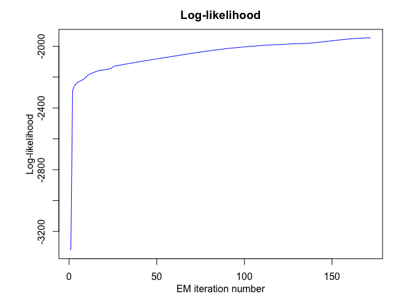
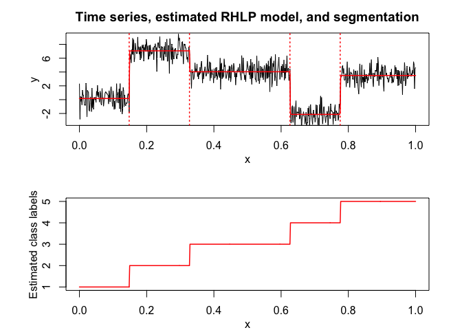

<!-- README.md is generated from README.Rmd. Please edit that file -->

<!-- badges: start -->

<!-- badges: end -->

# Overview

Flexible and user-friendly probabilistic **segmentation** of time series
with smooth and/or abrupt **regime changes** by a **mixture
model-based** regression approach with a hidden logistic process, fitted
by the EM algorithm.

# Installation

You can install the RHLP package from [GitHub](https://github.com/)
with:

``` r
# install.packages("devtools")
devtools::install_github("fchamroukhi/RHLP")
```

To build *vignettes* for examples of usage, type the command below
instead:

``` r
# install.packages("devtools")
devtools::install_github("fchamroukhi/RHLP", 
                         build_opts = c("--no-resave-data", "--no-manual"), 
                         build_vignettes = TRUE)
```

Use the following command to display vignettes:

``` r
browseVignettes("RHLP")
```

# Usage

``` r
library(RHLP)
```

``` r
# Application to a toy data set
data("toydataset")
x <- toydataset$x
y <- toydataset$y

K <- 5 # Number of regimes (mixture components)
p <- 3 # Dimension of beta (order of the polynomial regressors)
q <- 1 # Dimension of w (order of the logistic regression: to be set to 1 for segmentation)
variance_type <- "heteroskedastic" # "heteroskedastic" or "homoskedastic" model

n_tries <- 1
max_iter = 1500
threshold <- 1e-6
verbose <- TRUE
verbose_IRLS <- FALSE

rhlp <- emRHLP(X = x, Y = y, K, p, q, variance_type, n_tries, 
               max_iter, threshold, verbose, verbose_IRLS)
#> EM - RHLP: Iteration: 1 | log-likelihood: -2119.27308534609
#> EM - RHLP: Iteration: 2 | log-likelihood: -1149.01040321999
#> EM - RHLP: Iteration: 3 | log-likelihood: -1118.20384281234
#> EM - RHLP: Iteration: 4 | log-likelihood: -1096.88260636121
#> EM - RHLP: Iteration: 5 | log-likelihood: -1067.55719357295
#> EM - RHLP: Iteration: 6 | log-likelihood: -1037.26620122646
#> EM - RHLP: Iteration: 7 | log-likelihood: -1022.71743069484
#> EM - RHLP: Iteration: 8 | log-likelihood: -1006.11825447077
#> EM - RHLP: Iteration: 9 | log-likelihood: -1001.18491883952
#> EM - RHLP: Iteration: 10 | log-likelihood: -1000.91250763556
#> EM - RHLP: Iteration: 11 | log-likelihood: -1000.62280600209
#> EM - RHLP: Iteration: 12 | log-likelihood: -1000.3030988811
#> EM - RHLP: Iteration: 13 | log-likelihood: -999.932334880131
#> EM - RHLP: Iteration: 14 | log-likelihood: -999.484219706691
#> EM - RHLP: Iteration: 15 | log-likelihood: -998.928118038989
#> EM - RHLP: Iteration: 16 | log-likelihood: -998.234244664472
#> EM - RHLP: Iteration: 17 | log-likelihood: -997.359536276056
#> EM - RHLP: Iteration: 18 | log-likelihood: -996.152654857298
#> EM - RHLP: Iteration: 19 | log-likelihood: -994.697863447307
#> EM - RHLP: Iteration: 20 | log-likelihood: -993.186583974542
#> EM - RHLP: Iteration: 21 | log-likelihood: -991.81352379631
#> EM - RHLP: Iteration: 22 | log-likelihood: -990.611295217008
#> EM - RHLP: Iteration: 23 | log-likelihood: -989.539226273251
#> EM - RHLP: Iteration: 24 | log-likelihood: -988.55311887915
#> EM - RHLP: Iteration: 25 | log-likelihood: -987.539963690533
#> EM - RHLP: Iteration: 26 | log-likelihood: -986.073920116541
#> EM - RHLP: Iteration: 27 | log-likelihood: -983.263549878169
#> EM - RHLP: Iteration: 28 | log-likelihood: -979.340492188909
#> EM - RHLP: Iteration: 29 | log-likelihood: -977.468559852711
#> EM - RHLP: Iteration: 30 | log-likelihood: -976.653534236095
#> EM - RHLP: Iteration: 31 | log-likelihood: -976.5893387433
#> EM - RHLP: Iteration: 32 | log-likelihood: -976.589338067237

rhlp$summary()
#> ---------------------
#> Fitted RHLP model
#> ---------------------
#> 
#> RHLP model with K = 5 components:
#> 
#>  log-likelihood nu       AIC       BIC       ICL
#>       -976.5893 33 -1009.589 -1083.959 -1083.176
#> 
#> Clustering table (Number of observations in each regimes):
#> 
#>   1   2   3   4   5 
#> 100 120 200 100 150 
#> 
#> Regression coefficients:
#> 
#>       Beta(k = 1) Beta(k = 2) Beta(k = 3) Beta(k = 4) Beta(k = 5)
#> 1    6.031875e-02   -5.434903   -2.770416    120.7699    4.027542
#> X^1 -7.424718e+00  158.705091   43.879453   -474.5888   13.194261
#> X^2  2.931652e+02 -650.592347  -94.194780    597.7948  -33.760603
#> X^3 -1.823560e+03  865.329795   67.197059   -244.2386   20.402153
#> 
#> Variances:
#> 
#>  Sigma2(k = 1) Sigma2(k = 2) Sigma2(k = 3) Sigma2(k = 4) Sigma2(k = 5)
#>       1.220624      1.110243      1.079394     0.9779734      1.028332

rhlp$plot()
```



``` r
# Application to a real data set
data("realdataset")
x <- realdataset$x
y <- realdataset$y2

K <- 5 # Number of regimes (mixture components)
p <- 3 # Dimension of beta (order of the polynomial regressors)
q <- 1 # Dimension of w (order of the logistic regression: to be set to 1 for segmentation)
variance_type <- "heteroskedastic" # "heteroskedastic" or "homoskedastic" model

n_tries <- 1
max_iter = 1500
threshold <- 1e-6
verbose <- TRUE
verbose_IRLS <- FALSE

rhlp <- emRHLP(X = x, Y = y, K, p, q, variance_type, n_tries, 
               max_iter, threshold, verbose, verbose_IRLS)
#> EM - RHLP: Iteration: 1 | log-likelihood: -3321.6485760125
#> EM - RHLP: Iteration: 2 | log-likelihood: -2286.48632282875
#> EM - RHLP: Iteration: 3 | log-likelihood: -2257.60498391374
#> EM - RHLP: Iteration: 4 | log-likelihood: -2243.74506764308
#> EM - RHLP: Iteration: 5 | log-likelihood: -2233.3426635247
#> EM - RHLP: Iteration: 6 | log-likelihood: -2226.89953345319
#> EM - RHLP: Iteration: 7 | log-likelihood: -2221.77999023589
#> EM - RHLP: Iteration: 8 | log-likelihood: -2215.81305295291
#> EM - RHLP: Iteration: 9 | log-likelihood: -2208.25998029539
#> EM - RHLP: Iteration: 10 | log-likelihood: -2196.27872403055
#> EM - RHLP: Iteration: 11 | log-likelihood: -2185.40049009242
#> EM - RHLP: Iteration: 12 | log-likelihood: -2180.13934245387
#> EM - RHLP: Iteration: 13 | log-likelihood: -2175.4276274402
#> EM - RHLP: Iteration: 14 | log-likelihood: -2170.86113669353
#> EM - RHLP: Iteration: 15 | log-likelihood: -2165.34927170608
#> EM - RHLP: Iteration: 16 | log-likelihood: -2161.12419211511
#> EM - RHLP: Iteration: 17 | log-likelihood: -2158.63709280617
#> EM - RHLP: Iteration: 18 | log-likelihood: -2156.19846850913
#> EM - RHLP: Iteration: 19 | log-likelihood: -2154.04107470071
#> EM - RHLP: Iteration: 20 | log-likelihood: -2153.24544245686
#> EM - RHLP: Iteration: 21 | log-likelihood: -2151.74944795242
#> EM - RHLP: Iteration: 22 | log-likelihood: -2149.90781423151
#> EM - RHLP: Iteration: 23 | log-likelihood: -2146.40042232588
#> EM - RHLP: Iteration: 24 | log-likelihood: -2142.37530025533
#> EM - RHLP: Iteration: 25 | log-likelihood: -2134.85493291884
#> EM - RHLP: Iteration: 26 | log-likelihood: -2129.67399002071
#> EM - RHLP: Iteration: 27 | log-likelihood: -2126.44739300481
#> EM - RHLP: Iteration: 28 | log-likelihood: -2124.94603052064
#> EM - RHLP: Iteration: 29 | log-likelihood: -2122.51637426267
#> EM - RHLP: Iteration: 30 | log-likelihood: -2121.01493646146
#> EM - RHLP: Iteration: 31 | log-likelihood: -2118.45402063643
#> EM - RHLP: Iteration: 32 | log-likelihood: -2116.9336204919
#> EM - RHLP: Iteration: 33 | log-likelihood: -2114.34424563452
#> EM - RHLP: Iteration: 34 | log-likelihood: -2112.84844186712
#> EM - RHLP: Iteration: 35 | log-likelihood: -2110.34494568025
#> EM - RHLP: Iteration: 36 | log-likelihood: -2108.81734757025
#> EM - RHLP: Iteration: 37 | log-likelihood: -2106.26527191053
#> EM - RHLP: Iteration: 38 | log-likelihood: -2104.96591147986
#> EM - RHLP: Iteration: 39 | log-likelihood: -2102.43927829964
#> EM - RHLP: Iteration: 40 | log-likelihood: -2101.27820194404
#> EM - RHLP: Iteration: 41 | log-likelihood: -2098.81151697567
#> EM - RHLP: Iteration: 42 | log-likelihood: -2097.48008514591
#> EM - RHLP: Iteration: 43 | log-likelihood: -2094.98259556552
#> EM - RHLP: Iteration: 44 | log-likelihood: -2093.66517040802
#> EM - RHLP: Iteration: 45 | log-likelihood: -2091.23625905564
#> EM - RHLP: Iteration: 46 | log-likelihood: -2089.91118603989
#> EM - RHLP: Iteration: 47 | log-likelihood: -2087.67388435026
#> EM - RHLP: Iteration: 48 | log-likelihood: -2086.11373786756
#> EM - RHLP: Iteration: 49 | log-likelihood: -2083.84931461869
#> EM - RHLP: Iteration: 50 | log-likelihood: -2082.16175664198
#> EM - RHLP: Iteration: 51 | log-likelihood: -2080.45137011098
#> EM - RHLP: Iteration: 52 | log-likelihood: -2078.37066132008
#> EM - RHLP: Iteration: 53 | log-likelihood: -2077.06827662071
#> EM - RHLP: Iteration: 54 | log-likelihood: -2074.66718553694
#> EM - RHLP: Iteration: 55 | log-likelihood: -2073.68137124781
#> EM - RHLP: Iteration: 56 | log-likelihood: -2071.20390017789
#> EM - RHLP: Iteration: 57 | log-likelihood: -2069.88260759288
#> EM - RHLP: Iteration: 58 | log-likelihood: -2067.30246728287
#> EM - RHLP: Iteration: 59 | log-likelihood: -2066.08897944236
#> EM - RHLP: Iteration: 60 | log-likelihood: -2064.14482062792
#> EM - RHLP: Iteration: 61 | log-likelihood: -2062.39859624374
#> EM - RHLP: Iteration: 62 | log-likelihood: -2060.73756242314
#> EM - RHLP: Iteration: 63 | log-likelihood: -2058.4448132974
#> EM - RHLP: Iteration: 64 | log-likelihood: -2057.23564743141
#> EM - RHLP: Iteration: 65 | log-likelihood: -2054.73129678764
#> EM - RHLP: Iteration: 66 | log-likelihood: -2053.66525147972
#> EM - RHLP: Iteration: 67 | log-likelihood: -2051.05262427909
#> EM - RHLP: Iteration: 68 | log-likelihood: -2049.89030367995
#> EM - RHLP: Iteration: 69 | log-likelihood: -2047.68843285481
#> EM - RHLP: Iteration: 70 | log-likelihood: -2046.16052536146
#> EM - RHLP: Iteration: 71 | log-likelihood: -2044.92677581091
#> EM - RHLP: Iteration: 72 | log-likelihood: -2042.67687818721
#> EM - RHLP: Iteration: 73 | log-likelihood: -2041.77608506749
#> EM - RHLP: Iteration: 74 | log-likelihood: -2039.40345316134
#> EM - RHLP: Iteration: 75 | log-likelihood: -2038.20062153928
#> EM - RHLP: Iteration: 76 | log-likelihood: -2036.05846372404
#> EM - RHLP: Iteration: 77 | log-likelihood: -2034.52492449426
#> EM - RHLP: Iteration: 78 | log-likelihood: -2033.44774900177
#> EM - RHLP: Iteration: 79 | log-likelihood: -2031.15837908019
#> EM - RHLP: Iteration: 80 | log-likelihood: -2030.29908045026
#> EM - RHLP: Iteration: 81 | log-likelihood: -2028.08193331457
#> EM - RHLP: Iteration: 82 | log-likelihood: -2026.82779637097
#> EM - RHLP: Iteration: 83 | log-likelihood: -2025.51219569808
#> EM - RHLP: Iteration: 84 | log-likelihood: -2023.47136697978
#> EM - RHLP: Iteration: 85 | log-likelihood: -2022.86702240332
#> EM - RHLP: Iteration: 86 | log-likelihood: -2021.05803372565
#> EM - RHLP: Iteration: 87 | log-likelihood: -2019.68013062929
#> EM - RHLP: Iteration: 88 | log-likelihood: -2018.57796815284
#> EM - RHLP: Iteration: 89 | log-likelihood: -2016.51065270015
#> EM - RHLP: Iteration: 90 | log-likelihood: -2015.84957111014
#> EM - RHLP: Iteration: 91 | log-likelihood: -2014.25626618564
#> EM - RHLP: Iteration: 92 | log-likelihood: -2012.83069679254
#> EM - RHLP: Iteration: 93 | log-likelihood: -2012.36700738444
#> EM - RHLP: Iteration: 94 | log-likelihood: -2010.80319327333
#> EM - RHLP: Iteration: 95 | log-likelihood: -2009.62231094925
#> EM - RHLP: Iteration: 96 | log-likelihood: -2009.18020396728
#> EM - RHLP: Iteration: 97 | log-likelihood: -2007.70135886708
#> EM - RHLP: Iteration: 98 | log-likelihood: -2006.56703696874
#> EM - RHLP: Iteration: 99 | log-likelihood: -2006.01673291469
#> EM - RHLP: Iteration: 100 | log-likelihood: -2004.41194242792
#> EM - RHLP: Iteration: 101 | log-likelihood: -2003.4625414477
#> EM - RHLP: Iteration: 102 | log-likelihood: -2002.88040058763
#> EM - RHLP: Iteration: 103 | log-likelihood: -2001.35926477816
#> EM - RHLP: Iteration: 104 | log-likelihood: -2000.57003100128
#> EM - RHLP: Iteration: 105 | log-likelihood: -2000.13742634303
#> EM - RHLP: Iteration: 106 | log-likelihood: -1998.8742667185
#> EM - RHLP: Iteration: 107 | log-likelihood: -1997.9672441114
#> EM - RHLP: Iteration: 108 | log-likelihood: -1997.53617878001
#> EM - RHLP: Iteration: 109 | log-likelihood: -1996.26856906479
#> EM - RHLP: Iteration: 110 | log-likelihood: -1995.29073069489
#> EM - RHLP: Iteration: 111 | log-likelihood: -1994.96901833912
#> EM - RHLP: Iteration: 112 | log-likelihood: -1994.04338389315
#> EM - RHLP: Iteration: 113 | log-likelihood: -1992.93228304533
#> EM - RHLP: Iteration: 114 | log-likelihood: -1992.58825334521
#> EM - RHLP: Iteration: 115 | log-likelihood: -1992.08820485443
#> EM - RHLP: Iteration: 116 | log-likelihood: -1990.99459284997
#> EM - RHLP: Iteration: 117 | log-likelihood: -1990.39820233453
#> EM - RHLP: Iteration: 118 | log-likelihood: -1990.25156085256
#> EM - RHLP: Iteration: 119 | log-likelihood: -1990.02689844513
#> EM - RHLP: Iteration: 120 | log-likelihood: -1989.4524459209
#> EM - RHLP: Iteration: 121 | log-likelihood: -1988.77939887023
#> EM - RHLP: Iteration: 122 | log-likelihood: -1988.43670301286
#> EM - RHLP: Iteration: 123 | log-likelihood: -1988.05097380424
#> EM - RHLP: Iteration: 124 | log-likelihood: -1987.13583867675
#> EM - RHLP: Iteration: 125 | log-likelihood: -1986.24508709354
#> EM - RHLP: Iteration: 126 | log-likelihood: -1985.66862327892
#> EM - RHLP: Iteration: 127 | log-likelihood: -1984.91555844651
#> EM - RHLP: Iteration: 128 | log-likelihood: -1984.02840365821
#> EM - RHLP: Iteration: 129 | log-likelihood: -1983.69130067161
#> EM - RHLP: Iteration: 130 | log-likelihood: -1983.59891631866
#> EM - RHLP: Iteration: 131 | log-likelihood: -1983.46950685882
#> EM - RHLP: Iteration: 132 | log-likelihood: -1983.16677154063
#> EM - RHLP: Iteration: 133 | log-likelihood: -1982.7130488681
#> EM - RHLP: Iteration: 134 | log-likelihood: -1982.36482921383
#> EM - RHLP: Iteration: 135 | log-likelihood: -1982.09501016661
#> EM - RHLP: Iteration: 136 | log-likelihood: -1981.45901315766
#> EM - RHLP: Iteration: 137 | log-likelihood: -1980.56116931257
#> EM - RHLP: Iteration: 138 | log-likelihood: -1979.78682525118
#> EM - RHLP: Iteration: 139 | log-likelihood: -1978.57039689029
#> EM - RHLP: Iteration: 140 | log-likelihood: -1977.62583903156
#> EM - RHLP: Iteration: 141 | log-likelihood: -1976.44993964017
#> EM - RHLP: Iteration: 142 | log-likelihood: -1975.34352117182
#> EM - RHLP: Iteration: 143 | log-likelihood: -1973.94511304916
#> EM - RHLP: Iteration: 144 | log-likelihood: -1972.69707782729
#> EM - RHLP: Iteration: 145 | log-likelihood: -1971.24412635765
#> EM - RHLP: Iteration: 146 | log-likelihood: -1970.06230181165
#> EM - RHLP: Iteration: 147 | log-likelihood: -1968.63106242841
#> EM - RHLP: Iteration: 148 | log-likelihood: -1967.54773416029
#> EM - RHLP: Iteration: 149 | log-likelihood: -1966.19481640747
#> EM - RHLP: Iteration: 150 | log-likelihood: -1965.07487280506
#> EM - RHLP: Iteration: 151 | log-likelihood: -1963.69466194804
#> EM - RHLP: Iteration: 152 | log-likelihood: -1962.43103040224
#> EM - RHLP: Iteration: 153 | log-likelihood: -1961.13942311651
#> EM - RHLP: Iteration: 154 | log-likelihood: -1959.76348415393
#> EM - RHLP: Iteration: 155 | log-likelihood: -1958.66111557445
#> EM - RHLP: Iteration: 156 | log-likelihood: -1957.08412155615
#> EM - RHLP: Iteration: 157 | log-likelihood: -1956.38405033098
#> EM - RHLP: Iteration: 158 | log-likelihood: -1955.13976323662
#> EM - RHLP: Iteration: 159 | log-likelihood: -1954.0307602366
#> EM - RHLP: Iteration: 160 | log-likelihood: -1953.28771131999
#> EM - RHLP: Iteration: 161 | log-likelihood: -1951.68947232015
#> EM - RHLP: Iteration: 162 | log-likelihood: -1950.97779043109
#> EM - RHLP: Iteration: 163 | log-likelihood: -1950.82786273359
#> EM - RHLP: Iteration: 164 | log-likelihood: -1950.39568293481
#> EM - RHLP: Iteration: 165 | log-likelihood: -1949.51404624208
#> EM - RHLP: Iteration: 166 | log-likelihood: -1948.906374824
#> EM - RHLP: Iteration: 167 | log-likelihood: -1948.43487893552
#> EM - RHLP: Iteration: 168 | log-likelihood: -1947.2118394595
#> EM - RHLP: Iteration: 169 | log-likelihood: -1946.34871715855
#> EM - RHLP: Iteration: 170 | log-likelihood: -1946.22041468711
#> EM - RHLP: Iteration: 171 | log-likelihood: -1946.2132265072
#> EM - RHLP: Iteration: 172 | log-likelihood: -1946.21315057723

rhlp$summary()
#> ---------------------
#> Fitted RHLP model
#> ---------------------
#> 
#> RHLP model with K = 5 components:
#> 
#>  log-likelihood nu       AIC       BIC       ICL
#>       -1946.213 33 -1979.213 -2050.683 -2050.449
#> 
#> Clustering table (Number of observations in each regimes):
#> 
#>   1   2   3   4   5 
#>  16 129 180 111 126 
#> 
#> Regression coefficients:
#> 
#>     Beta(k = 1) Beta(k = 2) Beta(k = 3) Beta(k = 4) Beta(k = 5)
#> 1      2187.539   330.05723   1508.2809 -13446.7332  6417.62830
#> X^1  -15032.659  -107.79782  -1648.9562  11321.4509 -3571.94090
#> X^2  -56433.432    14.40154    786.5723  -3062.2825   699.55894
#> X^3  494014.670    56.88016   -118.0693    272.7844   -45.42922
#> 
#> Variances:
#> 
#>  Sigma2(k = 1) Sigma2(k = 2) Sigma2(k = 3) Sigma2(k = 4) Sigma2(k = 5)
#>       8924.363      49.22616       78.2758      105.6606      15.66317

rhlp$plot()
```



# Model selection

In this package, it is possible to select models based on information
criteria such as **BIC**, **AIC** and **ICL**.

The selection can be done for the two following parameters:

  - **K**: The number of regimes;
  - **p**: The order of the polynomial regression.

Let’s select a RHLP model for the following time series **Y**:

``` r
data("toydataset")
x <- toydataset$x
y <- toydataset$y

plot(x, y, type = "l", xlab = "x", ylab = "Y")
```


``` r
selectedrhlp <- selectRHLP(X = x, Y = y, Kmin = 2, Kmax = 6, pmin = 0, pmax = 3)
#> The RHLP model selected via the "BIC" has K = 5 regimes 
#>  and the order of the polynomial regression is p = 0.
#> BIC = -1041.40789532438
#> AIC = -1000.84239591291

selectedrhlp$plot(what = "estimatedsignal")
```


